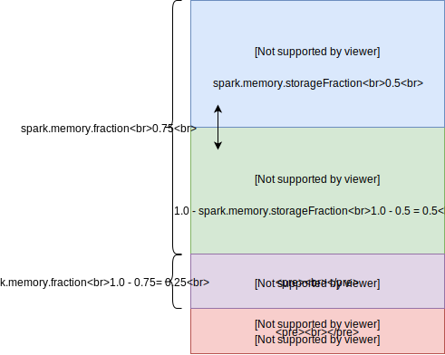

# Pyspark Tooling

## Install

Pyspark utility functions


```
pip install pyspark-tooling
```


## EMR Deployment

This package contains certain class methods that are designed to allow you to get up and running with EMR very quickly, even if you are relatively new to EMR.


### Quickstart

The simplest way to create a new EMR cluster and run your spark job is to use the `Cluster.from_defaults()` static method.

```python
from pyspark_tooling.emr import Cluster

# define a new cluster 
cluster = Cluster.from_defaults(
    # the name of the cluster
    cluster_name="my_cluster_name", 
    # the s3 path to where the logs will be saved 
    log_uri="s3://my-bucket/logs", 
    # a list of bootstrap scripts to run when creating the cluster
    bootstrap_script_paths=["s3://my-bucket/bootstrap.sh"],
    # a list of emr env vars that will be availble to spark
    env_vars={
        "APPLICATION_NAME": "my_application",
        "LOG_LEVEL": "debug,
    },
    # the minimum amount of memory required by your spark job
    minimum_memory_in_gb=32,  
    # the minimum number of vcpus required by your spark job
    minimum_vcpus=12, 
    # terminate the cluster upon completion or failure
    keep_cluster_alive=False,
    # a list of tags for keeping track of cost etc
    tags=[{"Name": "Cost center", "Value": "my_team"}],
    # a list of subnet ids available for the cluster
    subnet_ids=["subnet-1", "subnet-2"],
)

# start the cluster and run the specified python files
cluster.run(
    # path to the python entypoint
    code_entrypoint_path="s3://my-bucket/main.py",  
    # path to your zipped application
    code_bundle_path="s3://my-bucket/bundle.zip",  
    # the cluster will execute asynchronously by default
    synchronous=False,  
)
```

The run method will execute the bootstrap scripts followed by the python entrypoint file you have provided. After executing the `run` method, the `Cluster` will execute asynchronously by default.

However, sometimes you may wish to synchronously monitor your cluster and take appropriate actions based on whether your job succeeds or fails, (for instance, if you are using an orchestration framework like Airflow). In this case you should pass the `synchronous=True` flag.

Note that the cluster will terminate whether it succeeds or fails because `keep_cluster_alive` is set to `False`.


### Long running clusters

Its possible that you may wish to have a long running cluster to which you submit jobs repeatedly over time. If this is the case then be sure to pass the `keep_cluster_alive=True` flag to the constructor. You can then use a few different methods to control your cluster:

```python
from pyspark_tooling.emr import Cluster, ActionOnFailure

# create a cluster definition
 cluster = Cluster.from_defaults(
    cluster_name="my_cluster_name",
    log_uri="s3://my-bucket/logs",
    # by default do not terminate the cluster upon job completion
    keep_cluster_alive=True,
 )

# the default steps definitions are:
# 1) setting up the logging output
# 2) running the given code
default_steps = cluster.get_default_steps(
    code_entrypoint_path="s3://my-bucket/main.py",  
    code_bundle_path="s3://my-bucket/bundle.zip",  
    action_on_failure=ActionOnFailure.Terminate,
)

# start the cluster and run these steps
cluster.start(default_steps)

# wait for all steps to complete synchronously
cluster.wait_for_steps_to_complete()

# here we define some additional steps to perform
additional_steps = [
    {
        "Name": "Another step",
        "ActionOnFailure": ActionOnFailure.Continue,
        "HadoopJarStep": {
            "Jar": "command-runner.jar",
            "Args": [
                "spark-submit",
                "--deploy-mode",
                "cluster",
                "--py-files",
                "s3://my-bucket/app.zip",
                "s3://my-bucket/main.py",
            ]
        },
    }
]

# add the additional step to the cluster
# you can queue up to 256 steps at a time
cluster.add_steps(additional_steps)

# again wait for all steps to complete
cluster.wait_for_steps_to_complete()

# terminate the cluster synchronously
cluster.terminate()
```


If at any time you want to check what is going on inside your cluster you can use the following methods:


```python
cluster_description = cluster.describe_cluster()

print(cluster_description)

steps_description = cluster.describe_steps()

print(steps_description)
```


## EMR Infrastructure calculations

The `Cluster.from_defaults()` function uses the `InfrastructureConfig` class to calculate amongst other things:

- what kind of EC2 instance is best
- how many EC2 instances you need
- the optimal number of executors
- the amount of memory and vcpus given to each executor
- the default number of partitions
- the amount of memory reserved for yarn


These calculations are made according to the [AWS best practice guide](https://aws.amazon.com/blogs/big-data/best-practices-for-successfully-managing-memory-for-apache-spark-applications-on-amazon-emr/).

There are some key parameters that you can pass to the `InfrastructureConfig` class constructor that will determine how your infrastructure is created. e.g

```python
from grada_pyspark_utils.emr import InfrstructureConfig, InstanceOptimization

# the config class will perform your calculations
infrastructure = InfrastructureConfig(
    minimum_memory_in_gb=32,
    minimum_vcpus=16,
    vcpus_per_executor=5,
    partitions_per_vcpu=2,
    yarn_memory_overhead_fraction=0.1,
    instance_optimization=InstanceOptimization.memory,
    num_executors_for_driver=1,
)

# extract the args as a dictionary
infrastructure_args = infrastructure.args()

# use these args to make a new cluster
cluster = Cluster(
    # other args go here...
    cluster_name="my_cluster",
    # unpack the infrastructure args
    **infrastructure_args
)

```


A brief description of these arguments follows.


#### 1) `instance_optimization` (default "memory")

The `instance_optimization` parameter simply refers to what kind of ec2 instance you want. It can be memory optimized, storage optimized, compute optimized or general. Since spark is particulary memory hungry it is recommended that you stick with a memory optimized instances. (Please note that this argument expects an enum, not a string).


#### 2) `minimum_memory_in_gb` (default 32)


The `minimum_memory_in_gb` paramter refers to the total memory (across all machines) that is required by your spark jobs, *not including the memory required by yarn or by spark's own internal processes*.

Normally you should know in advance roughly how much memory you will need, but this can also be a question of trial and error. Note that every row in your RDD is saved in more than one partition for the sake of redundancy, which means the size of your RDD might be much bigger than the size of your original data. If you are doing wide transformations such as joins you will need even more memory to shuffle the data around. 

As the [official documentation](https://spark.apache.org/docs/latest/hardware-provisioning.html) points out, the only way to know for sure how big your RDD is is to examine the Storage tab in the Spark UI.


#### 3) `vcpus_per_executor` (default 5)

The `vcpus_per_executor` parameter plays a *critical* role in determining how your cluster will function. On a high level, the `vcpus_per_executor` parameter refers to the number of vcpus that are assigned to each executor, *however*... it also determines how many executors will be used, and how much memory each executor will receive.

As an example, lets say there are 100 vcpus available across the entire cluster, and lets say we have decided to use the default 5 `vcpus_per_executor` as recommended by AWS. In this case, the number of executors will be calculated as 100 / 5, which is 20 executors. 

Note that the amount of memory given to each executor also follows from this calculation. Once we have calculated how many executors there will be, the available memory is evenly divided between all the executors. 

This parameter is therefore critical in determining 3 inter-related concerns, namely, how many vcpus each executor will have, thus how many executors there will be, and as a consequence, how much memory each of these executors will receive. (Please also note that this is the best-practice way to perform these calculations as recommended by AWS).

As an example, lets say you want to have less executors so that each executor has more memory. To achieve this effect you can increase the `vcpus_per_executor` parameter up to 10. This means the same 100 vcpus will now be be divided by 10 (rather than 5), resulting in only 10 executors. Now each executor will get a tenth of the available memory.


#### 4) `partitions_per_vcpu` (default 2) 

Each vcpu is given a certain number of partitions. This number is critical because it determines the amount of parallellism of your spark jobs. According to the best practice guide each vcpu can handle at least 2 partitions, sometimes more. However there may be scenarios where you actually want to limit the amount of parallellism in your cluster (this happens partiularly when you are doing a lot of wide transformations such as joins). In this case you could set `partitions_per_vcpu` to 1, so that each vcpu only has a single partition to deal with. Note that each vcpu should have at the bare minimum 1 partition, although this could be as high as 4 or 5 if you want to get the most out of your cluster.


#### 5) `num_executors_for_driver` (default 1)

According to the best practice guide the driver should be given the same amount of memory and the same number of vcpus as an executor. The `InfrastructureConfig` encourages you to think of driver as occupying a certain amount of resources which is described as a multiple of the resources occupied by a singleexecutors. So if you set  `num_executors_for_driver` to 2 then this means the driver will occupy 2 executor's worth of resources. At the bare minimum the driver should occupy 1 executor's worth of resources.


#### Advanced usage

Whilst these 5 parameters may seem simple, if you have  understood everything above, then you should be able to tune your EMR cluster even for quite advanced use cases.

If these calculations are too restrictive for you and you already know exactly what you want from your cluster, then you should consider invoking the `Cluster` class constructor directly. Please bear in mind that there are many paramaters that you will need to pass into the `Cluster` class constructor, after making your own calculations. Please do not rely on any defaults as it is assumed you are making your own calculations.


### Memory Tuning

Whilst the basic parameters listed above should be sufficient for most use cases there are also a few more advanced parameters for tweaking the memory profile used by spark.


#### 1) `yarn_memory_overhead_fraction` (default 0.1)

Of the total memory availbale in each machine, some memory is needed to run yarn. This is determined by the `yarn_memory_overhead_fraction` parameter which is 0.1 (or 10%) by default. 

Note that when you use the `InfrastructureConfig` class, an additional 10% of memory will be automatically factored in for you when choosing your infrastructure, so you don't have to worry about this.


#### 2) `spark_memory_fraction` (default 0.75)

Since 10% of the total memory is given to yarn, this leaves 90% left for spark. However, even within the memory given to spark there are many different processes with their own competing demands for memory.

We can describe these competiting demands for spark memory with the following diagram:





At the highest level, we can break the memory given to spark into 2 sections, which we can think of as "usable" memory and "not usable" memory. The "usable" part refers to the memory devoted to execution and storage. The "not usable" part refers to the "user memory" and "reserved memory". 

Note: the "user" memory technically *is* usable - you can put things like hash tables in there. However it is predominantly used for internal metadata and it is not likely that an average spark developer will choose to make use of it in their day to day programming. For this reason I have chosen to characterize it as "not usable".

The "spark_memory_fraction" simply refers to the fraction of memory that is usable, which by default is 0.75 or 75%. (Note that this is less conservative than what spark themselves recommend).

Again, when you use the `InfrastructureConfig` class, an additional 25% of memory will be automatically factored in to account for the user memory.


#### 3) `spark_memory_storage_fraction` (default 0.5)

So far we have shown that spark's "usable" memory is actually 75% of spark's memory, which is only 90% of the total memory. However even within the usable memory we have to break the available space into the part that is dedicated to *execution* i.e. calculations and processing, and the part that is dedicated to *storage*.

Getting this split right is actually quite tricky. You need to have enough space to store the results of previous calculations. However you also need to have enough space to make new calculations. This is something that you will have to experiment with based on your knowledge of what your code does. 


For those who wish to use an off-heap model - I have not yet supported off-heap model in my calculations. Please create an issue if you think I should support this.


# Transforms and Pipes

The motivation behind this repository is opinionated. The functions in this repository are mostly *transforms*, which are designed to be used in *pipes*. 

A *transform* is a function which takes in a `DataFrame` (or RDD) and spits out another `DataFrame`. In other words it has the following signature:

```python
from pyspark.sql import DataFrame

def identity_transform(df: DataFrame) -> DataFrame:
    """A transform that takes in a dataframe 
    and returns the same dataframe without any modifications"""
    return df
    
```

A pipe is a way of chaining transforms together into complex patterns.

As a simple example imagine we create a dataframe, then select a single column, then drop duplicates, and finally convert the dataframe to a list of tuples.

```python
from cytoolz import pipe, partial
from pyspark_tooling.dataframe import select_cols, deduplicate, to_tuples

data = [
    ('a', 1),
    ('a', 2),
    ('b', 1),
    ('b', 2),
    ('b', 3),
    ('c', 3),
    ('c', 4)
]

df = spark.createDataFrame(data, ['key', 'value'])


res = pipe(
    # the first argument must be the dataframe that is going to be piped
    df,
    # return a new dataframe with only a single column
    partial(select_cols, ['key']),
    # deduplicate this new dataframe
    dedeuplicate,
    # convert the dataframe into python tuples
    to_tuples,
)


print(res) # outputs => [('a',), ('b',), ('c',)]

```

Note that the `select_cols` function takes 2 arguments, the first is a list of columns to be selected and the second is the dataframe from which to select them. All transforms *must* have `df` as an argument, however they may optionally have other other arguments as well. In this case, the dataframe is always the *final* argument. The other arguments may be "pre-filled" using the `partial` function. The resulting pipe is essentially a list of transforms, where each transform takes a single dataframe and spits out a single dataframe.


A valid question is why should I use transforms and pipes? This is primarily because of unit testing. Each individual transform does exactly one simple thing and as such can be unit tested separately. Chaining these transforms together will then produce complex transformations that nevertheless produce reliable results.


## Development

Before working on this repository, please ensure you have copied the `.env.example` file and renamed it as `.env` or otherwise ensure the environment variables listed in the `.env.example` file are available at runtime.

To run the test suite simply cd to the root directory and run `make test`. Please note that the test suite requires that docker is installed.

Please look at the `Makefile` for a list of available commands.
